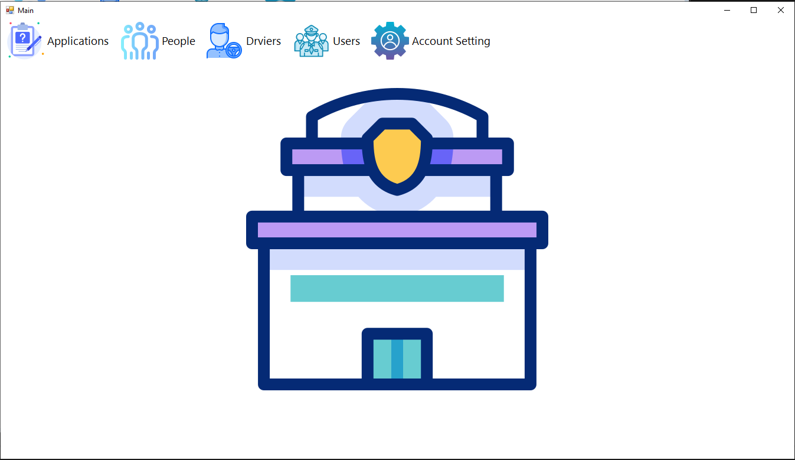
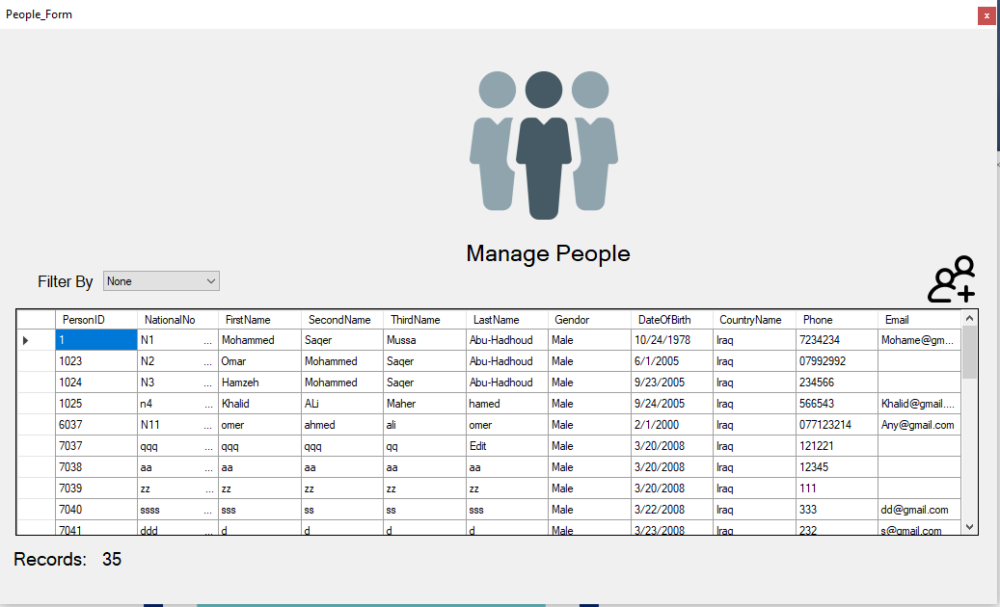
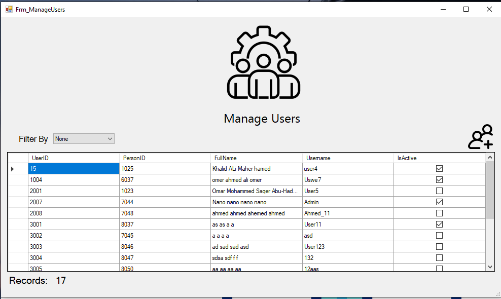
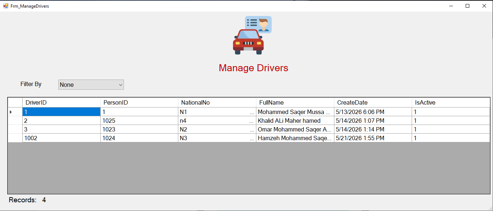

# 📑 DVLD - نظام إدارة رخص القيادة والمركبات

مشروع تعليمي (وليس منتجًا تجاريًا) يهدف إلى محاكاة نظام حكومي لإدارة دورة حياة رخص القيادة، من تقديم الطلب وحتى إصدار الرخصة، مرورًا بالفحوصات والغرامات.

هذا هو أول مشروع برمجي كبير لي. تم بناؤه من يناير 7، 2026، إلى يونيو 2026. الهدف الأساسي كان التعلم وتطبيق ما درسته في دورة DVLD خطوة بخطوة، مع محاولة فهم "لماذا" قبل "كيف".

## 🧠 لماذا هذا المشروع مهم بالنسبة لي؟

* هو أول مرة أكتب فيها نظامًا بهذا الحجم (آلاف الأسطر، عشرات الشاشات).
* تعلمت فيه كيفية تنظيم الكود إلى طبقات (UI, Business, Data).
* واجهت مشاكل حقيقية في قاعدة البيانات والربط بين الجداول، وحاولت حلها بنفسي.

## 🗄️ أبرز ما تعلمته: إدارة المعاملات (SqlTransaction)

في هذا المشروع، واجهت مشكلة: ماذا لو فشلت عملية حفظ البيانات في منتصف الطريق؟

مثلًا، عند حجز رخصة وفرض غرامة، يجب أن تتم العملية بالكامل أو لا تتم أبدًا. إذا فشل جزء، يجب أن يتراجع النظام عن كل ما فعله.

الأستاذ في الدورات السابقة لم يشرح هذه النقطة، لكنها كانت ضرورية لمنطق البرنامج. لذلك بحثت بنفسي، وتعلمت SqlTransaction، وطبقتها في النظام.

الآن، العمليات المالية والإدارية (حجز، فك حجز، إصدار رخصة) كلها محمية داخل Transaction. إذا حدث خطأ، يتم Rollback تلقائيًا.

## 🧱 هيكل المشروع

* طبقة البيانات (Data Layer): استعلامات SQL، إجراءات مخزنة، ودوال جدولية.
* طبقة الأعمال (Business Layer): قواعد العمل، التحقق من صحة البيانات، هندسة الطبقات الثلاث (Three-tier architecture).
* طبقة العرض (UI): واجهات Windows Forms مع عناصر تحكم قابلة لإعادة الاستخدام.

## 📚 الدروس المستفادة

* كتابة استعلامات SQL معقدة (LEFT JOIN, Subqueries, TVFs).
* الفرق بين INNER JOIN و LEFT JOIN عمليًا.
* إدارة حالات الطلب (جديد، ملغي، مكتمل).
* أهمية التحقق من صحة البيانات في أكثر من طبقة.
* التعامل مع الأخطاء والحالات الاستثنائية (Edge Cases).
* والأهم: الصبر. بعض المشاكل تستغرق ساعات من التفكير، لكنها تستحق.

## 📸 بعض الصور من النظام

.

## 📌 ملاحظة أخيرة

هذا المشروع ليس مثاليًا، وليس منافسًا للأنظمة التجارية. هو خطوة أولى في رحلة طويلة. لكنني فخور به، لأنه يمثل كل ما تعلمته في هذه الأشهر.
